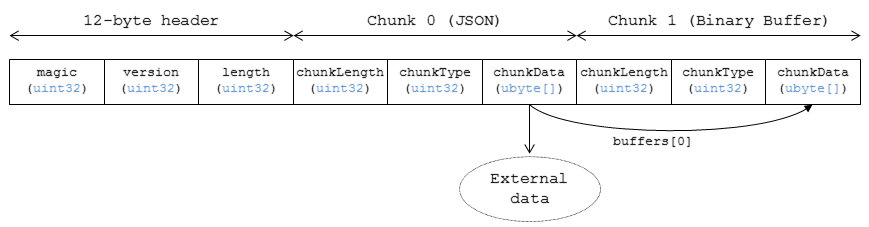

## 什么是gltf

---

为了优化3D场景描述文件的网络传输性能而诞生的文件格式。可被多种图形API以更简便，统一的方式进行解析加载。通常内容为Json，用于描述场景结构，材质/动画信息，并引入外部资源文件完成场景渲染

### gltf关键属性

#### 1. Scenes

一个gltf中可以包含多个场景，每个场景都需要一个根节点，由根节点开始描述场景树

#### 2. Nodes

gltf文档中可以包含多个节点，节点的类型由其包含的属性决定，可以是网格节点，摄像机节点等。节点一般有自己的位置属性以及包含子节点下标的数组。通过节点相连构成(多棵)场景树

#### 3. Meshes

网格对象由图元数组构成，每个图元又包含了构成该图元的顶点的属性信息以及索引信息

#### 4. Buffers

缓冲区用来存放/索引该文件中需要用到的各种信息，包括模型信息，贴图信息等。既可以利用*data-uri*的形式直接将数据放在gltf中，也可以写下文件路径，待加载时从外部文件读取信息。

#### 5. BufferViewers

一个二进制缓冲区可以同时包含多种数据内容(为了压缩空间)，Viewer就是对缓冲区信息加以分段的描述性对象

#### 6. Accessors

对缓冲区读取内容的描述器，一段缓冲区可能是float数组，也可能是short，也可能是vector3 float数组等。如何解释由accessor属性决定

除了以上属性外，gltf中还包含了诸如动画，材质等属性供应用进行解析。

### Ref

1. [gltf入门教程](https://github.com/KhronosGroup/glTF-Tutorials/blob/master/gltfTutorial/README.md)

## 什么是glb

glb是gltf的二进制形式。由三部分组成，分别是header, json chunk以及binary chunk

### 1. Header

文件头用于描述该文件的类型以及文件大小。其中的magic以及version都是固定值，length是整个文件的大小，单位为字节

### 2. json chunk

相当于将json文本内容按照二进制的形式进行保存；第一个chunk必须是json chunk，且仅有一个

### 3. binary chunk

gltf原buffer中包含的数据均可放在此处；binary chunk可以有多个

### chunk

chunk的格式较为统一，length说明该chunk的大小，单位字节；type仅有两种，一种是json chunk，另一种是binary chunk，不是这两种类型的chunk，默认实现是对其进行忽略；data数组则存储实际二进制数据。

