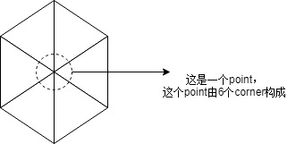

# 关于Draco

---

文档描述Draco的调用方式以及原理

draco的源码编写中，类的成员变量基本都是私有的，有两种方式访问这些变量

1. 利用Get/Set函数
2. 提供const函数，返回成员变量的常引用

## 关键词汇

### Point/Corner

​	

​	区分这个的意义在于：避免可能的冗余信息。

​	比如说位置信息，六个corner都有相同的位置信息，那么可以将这个位置信息存放到一个point上，建立corner到point之间的映射，当需要查询一个corner的位置信息时，通过映射关系就可以找到对应的point，进而获得point上的位置信息

​	再比如纹理信息，往往每个corner上的纹理信息都不相同（即便它们位置相同），此时纹理信息就可以直接绑定在corner上。

​	在构建Mesh的过程中，往往会出现同一个位置上的多个顶点，位置信息相同但纹理/法线信息不同。此时我们在安排顶点属性的时候，就会特别声明将这个属性按照point方式来存储，抑或是按照corner方式存储

## API使用方法

### 压缩


---

#### Encoder

​	压缩启动需要Encoder对象，Encoder对象继承自EncoderBase，相当于一个具体实现。能够通过该对象设置一些可配置属性，包括压缩速度以及压缩质量。最关键的函数为

```c++
Status EncodePointCloudToBuffer(const PointCloud &pc, EncoderBuffer *out_buffer);
Status EncodeMeshToBuffer(const Mesh &m, EncoderBuffer *out_buffer);
```

​	这两个函数将Mesh或者PointCloud进行压缩，并输出压缩后的数据(Mesh继承自PointCloud，Mesh相当于带有点之间关系的点云

​	参考:*draco/compression/encode.h*

#### PointCloud

​	两个关键字metadata attributes，可以利用**PointCloudBuilder**辅助创建点云

#### EntryValue

​	EntryValue的主要作用是作为值的容器。其核心的变量`std::vector<uint8_t>`即是利用`std::vector`依赖连续内存空间实现的特性，将一系列的数据，**不管其类型**，通通存放到连续的内存区域中。同时保证该内存区域能自由伸缩。

```c++
  template <typename DataTypeT>
  explicit EntryValue(const std::vector<DataTypeT> &data) {
    const size_t total_size = sizeof(DataTypeT) * data.size();
    data_.resize(total_size);
    memcpy(&data_[0], &data[0], total_size);
  }
```

​	从模板构造函数就可以看出，EntryValue通用容器的特性。

#### Metadata

​	从Metadata的成员变量可以看出，该类是作为EntryValue的容器。同时每个EntryValue又拥有自己的名称。

#### AttributeMetadata

​	从成员变量看，该类型继承于Metadata，并对其进行了简单的“修饰”。AttributeMetadata拥有自己的ID，注释上描述该ID是独一无二的，但从成员函数看并没有保证ID的独立性。

#### GeometryMetadata

​	虽然该类也继承于Metadata，但目前还没有任何看到它如何使用Metadata类。从成员函数以及成员变量分析，该类仅仅是AttributeMetadata的容器。

#### Mesh

​	利用**triangle_soup_mesh_builder**可以简洁地创建mesh

​	一个mesh关心两个数据，一个是PointAttribute，一个是Face。

#### PointAttribute

​	点属性的描述器，属性实际值存放于Attribute_buffer中，属性包括了position, normal, texcoord。其继承自GeometryAttribute，继承了缓冲区描述变量，包括byte_offset, byte_stride等。

​	每个点都有自己的ID,但也不排除不同的点会有相同的属性数据。这个描述器可以将属性值相同的数据进行合并，仅保留一份副本存放在内存中。另外又有一个index_map属性，用于存放点ID与属性位置之间的映射。

​	比如说A点和B点的属性数据相同，其属性值位于内存的X地址处，那么index_map[A]和index_map[B]都会存放X。

​	在不考虑消除重复属性值的情况下，还可以设置IdentityMapping和ExplicitMapping设置index_map的值。其中identityMapping相当于一一对应的关系，即一个点ID对应一个数据存储位置；而ExplicitMapping意味着手动设置内存位置对应关系，需要提供index_map的相关设置方法。	

#### Face

​	定义于Mesh类中，其实就是一个3元数组，元素为PointIndex。可以理解为存储索引的位置，存储的PointIndex可以通过PointAttribute索引出面上某个顶点的某个属性值。