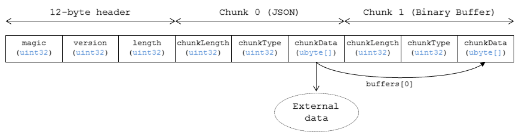

## 什么是gltf

---

为了优化3D场景描述文件的网络传输性能而诞生的文件格式。可被多种图形API以更简便，统一的方式进行解析加载。通常内容为Json，用于描述场景结构，材质/动画信息，并引入外部资源文件完成场景渲染

### gltf关键属性

#### 1. Scenes

一个gltf中可以包含多个场景，每个场景都需要一个根节点，由根节点开始描述场景树

#### 2. Nodes

gltf文档中可以包含多个节点，节点的类型由其包含的属性决定，可以是网格节点，摄像机节点等。节点一般有自己的位置属性以及包含子节点下标的数组。通过节点相连构成(多棵)场景树

#### 3. Meshes

网格对象由图元数组构成，每个图元又包含了构成该图元的顶点的属性信息以及索引信息。

图元(primitive)类型有点，线和面三大类，根据顶点组合方式不同又可以分出多种类型，一个模型可以同时包含多种图元类型。

一个图元对象下描述了顶点属性以及索引方式。

#### 4. Buffers

缓冲区用来存放/索引该文件中需要用到的各种信息，包括模型信息，贴图信息等。既可以利用*data-uri*的形式直接将数据放在gltf中，也可以写下文件路径，待加载时从外部文件读取信息。

*缓冲区作为内存片段，有内存对齐，大小端等内存布局问题需要注意。*

#### 5. BufferViewers

一个二进制缓冲区可以同时包含多种数据内容(为了压缩空间)，Viewer就是对缓冲区信息加以分段的描述性对象。每个viewer都规定其负责的数据片段属于顶点属性数据或者索引数据。

#### 6. Accessors

对缓冲区读取内容的描述器，一段缓冲区可能是float数组，也可能是short，也可能是vector3 float数组等。如何解释由accessor属性决定

除了以上属性外，gltf中还包含了诸如动画，材质等属性供应用进行解析。

### 内存布局的问题

* `accessor.byteOffset`必须是`accessor.componentType`的倍数
* `accessor.byteOffset` + Accessor关联的`bufferView.byteOffset`必须是`accessor.componentType`的倍数

## 什么是glb

glb是gltf的二进制形式。由三部分组成，分别是header, json chunk以及binary chunk

### 1. Header

文件头用于描述该文件的类型以及文件大小。其中的magic以及version都是固定值，length是整个文件的大小，单位为字节

### 2. json chunk

相当于将json文本内容按照二进制的形式进行保存；第一个chunk必须是json chunk，且仅有一个

### 3. binary chunk

gltf原buffer中包含的数据均可放在此处；binary chunk可以有多个

### chunk

chunk的格式较为统一，length说明该chunk的大小，单位字节；type仅有两种，一种是json chunk，另一种是binary chunk，不是这两种类型的chunk，默认实现是对其进行忽略；data数组则存储实际二进制数据。

## Draco的扩展

gltf中的material，primitive等都支持扩展，所谓扩展就是向gltf中绑定更多数据，并用额外的规约说明这些数据的用途。所有的扩展都需要在全局属性`extensionsUsed`以及`extensionsRequired`中进行标注声明。

* `Used`代表当前gltf文件中使用到的扩展，加载引擎假如不支持该扩展，可以无视包含该扩展的一切对象并正常加载gltf的基本版本
* `required`则代表当前gltf文件必须使用某个扩展，假如引擎不支持该扩展，则不可以成功加载该文件。

所以`required`是`used`的子集

Draco的扩展是`KHR_draco_mesh_compression`。目前该扩展只能用在primitive上，且primitive的mode必须是triangle或者triangle strip。

对于exporter而言，在输出一个支持draco扩展的primitive时，必须设置好primitive的attributes以及indices属性。

* attributes指向的是一个accessor的id，对应id的accessor不需要设置具体的bufferView，以及byteOffset。只需要设置好component，type等描述数据结构的属性
* indices需要设置为**解压后的索引**

另外，primitive中还需要添加extensions对象。该对象中包含了KHR_draco_mesh_compression对象，而该对象又包括一个bufferView以及一系列的attributes

* bufferView用于指定包含draco压缩数据的buffer段
* attributes包含的属性必须是之前primitive所包含的属性的子集。比如原primitive中有属性POS, NOR以及TEX；那么extensions的attributes就只能包含这些属性，额外的属性将会被忽视。而且这里的attribute跟着的数字是draco::Mesh中对应的attribute的id，而不是accessor的id。

具体设置可以参考draco_mesh_compression规约[3]

## 参考

---

1. [gltf文件规约](https://github.com/KhronosGroup/glTF/tree/master/specification/2.0)
2. [gltf入门教程](https://github.com/KhronosGroup/glTF-Tutorials/blob/master/gltfTutorial/README.md)
3. [draco_mesh_compression规约](https://github.com/KhronosGroup/glTF/blob/master/extensions/2.0/Khronos/KHR_draco_mesh_compression/README.md)